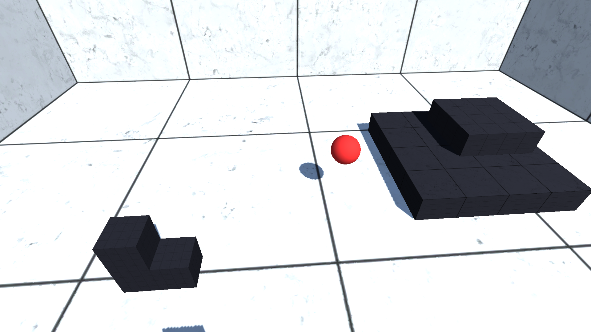
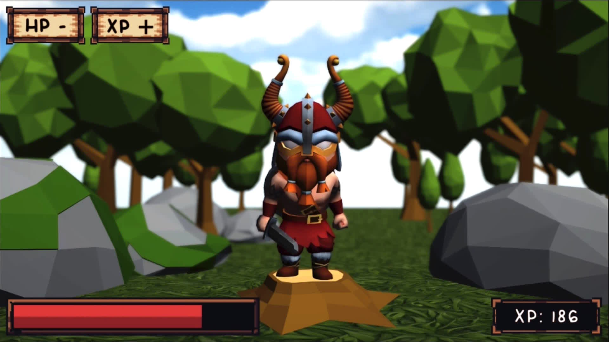
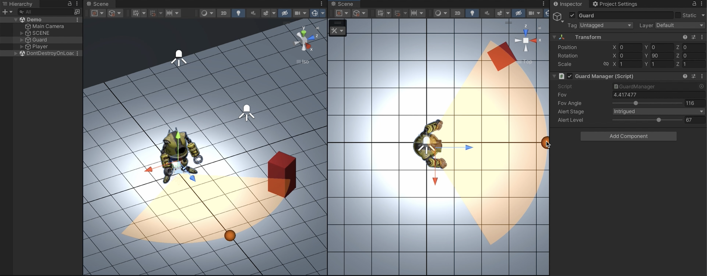
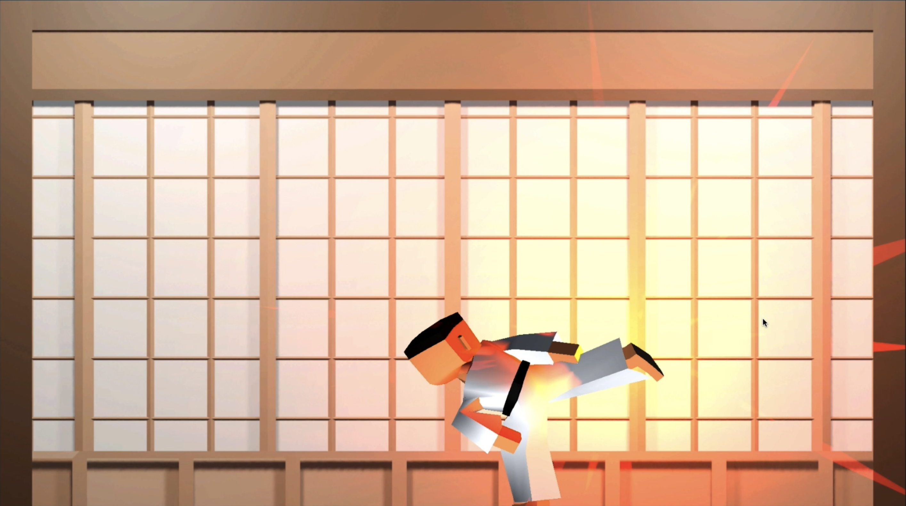
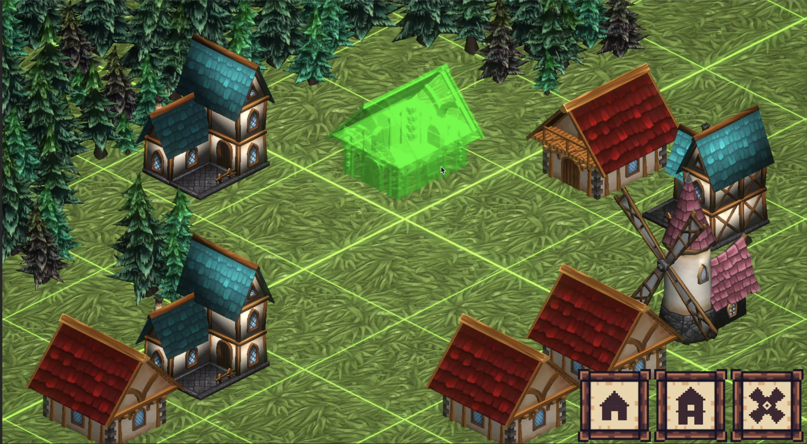

# [Unity/C#] Tutorials

**Mina Pêcheux - Since November 2022**

This repo contains the code and assets for the various Unity/C# tutorials I published as texts/videos on YouTube and Medium (🇬🇧 + 🇫🇷).

---

As of now, the repo contains some global assets/settings, and personal libraries (in the `Assets/Dependencies/` folder), like:

- `BehaviorTree`: A basic C# library implementing abstract node and tree structures to create behaviour trees. You can see an example of usage in [Tutorial 01: Using behaviour trees for a RTS collector AI](#tutorial-01_bts-rts).
- `AStar`: A basic C# library with A* pathfinding algorithms. For now, it's only for 2D tilemaps - the code was adapted from [this great Github](https://github.com/pixelfac/2D-Astar-Pathfinding-in-Unity) by pixelfac.

---

And in the `Assets/` folder, you'll find the code and assets for the following tutorials:

## 01. Using behaviour trees for a RTS collector AI [
](#tutorial-01_bts-rts)

Discover how to use the behaviour tree AI design pattern to give some life to RTS collector units! These little trucks will chop down
trees or mine ores to gather wood and minerals, auto-finding the closest targets and regularly delivering their resources to a nearby
depot, until the entire map is empty...

- Watch on YouTube: [in English 🇬🇧](https://www.youtube.com/watch?v=ySIzNaW0HUI), [in French 🇫🇷](https://www.youtube.com/watch?v=utbQapz6DoU)
- Read on [Medium](https://mina-pecheux.medium.com/using-behaviour-trees-for-a-rts-collector-ai-in-unity-c-dca24243ebce)
- See the files [in the repo](/Assets/01-BehaviourTreesRTS/)

## 02. Creating a day-and-night cycle system [
](#tutorial-02_day-and-night)

Learn how to setup a basic day-and-night cycle in a 2D scene, by changing the global light and toggling some smaller spots.

- Watch on YouTube: [in English 🇬🇧](https://www.youtube.com/watch?v=O997NxQGQ6A), [in French 🇫🇷](https://www.youtube.com/watch?v=CHV9xLaFf8w)
- Read on [Medium](https://mina-pecheux.medium.com/creating-a-basic-day-and-night-cycle-in-unity-c-dff942c1690d)
- See the files [in the repo](/Assets/02-DayAndNightCycle/)

## 03. How to use Unity's new input system [
](#tutorial-03_new-input-system)

Want to learn more about Unity's new InputSystem package, and how you can use it to create basic cross-platform player controller that supports
            both gamepads and keyboard+mouse layouts? Then check out this quick tutorial :)

- Watch on YouTube: [in English 🇬🇧](https://youtu.be/SyA4PPiXorI), [in French 🇫🇷](https://www.youtube.com/watch?v=m5ePVtQq-zo)
- Read on [Medium](https://medium.com/codex/why-you-should-use-unitys-new-input-system-268773863c4)
- See the files [in the repo](/Assets/03-NewInputSystem/)

**Important note:** The repo contains an extended version of the `HeroController.cs` script we make in the YouTube video with additional camera control (you can find it in the `HeroControllerWithCamera.cs` script). To use it, replace the `HeroController` component with the `HeroControllerWithCamera` on the "Hero" object, and then disable the "Aim" feature of the Cinemachine camera, so the script is free to rotate the view as it wants :)

## 04. How to use Unity's Scriptable Objects

Want to learn more about Unity's Scriptable Objects, and how you can use it to store custom data types in an efficient way? Then check out this tutorial :)

- Watch on YouTube: [in English 🇬🇧](https://www.youtube.com/watch?v=ZnHxxADBAQ0), [in French 🇫🇷](https://www.youtube.com/watch?v=q81A6cjdGcY)
- Read on [Medium](https://mina-pecheux.medium.com/discovering-the-power-of-unitys-scriptable-objects-53ae6e0acef4)
- See the files [in the repo](/Assets/04-ScriptableObjects/)

## 05. Creating a basic field of vision system

Learn how to make a simple field of vision (FOV) system for a robot guard unit with custom debug gizmos for easy visualisation and tweaking, and with related alertness levels.

- Watch on YouTube: [in English 🇬🇧](https://www.youtube.com/watch?v=2Q5n7KFsr3s), [in French 🇫🇷](https://www.youtube.com/watch?v=81Lz19C88C0)
- Read on [Medium](https://mina-pecheux.medium.com/creating-a-basic-field-of-vision-system-in-unity-c-718b58951cf6)
- See the files [in the repo](/Assets/05-GuardFOV/)

## 06. The power of custom animation events

Wanna discover how to embed events in your Unity animation clips to precisely time callbacks and trigger specific reactions all throughout the moves of your hero avatars? Check out this quick tutorial! :)

- Watch on YouTube: [in English 🇬🇧](https://www.youtube.com/watch?v=7xNI2hUoXWw), [in French 🇫🇷](https://www.youtube.com/watch?v=Mg6DsLlhddU)
- See the files [in the repo](/Assets/06-AnimationEvents/)

## 07. Implementing a basic building placement system

If you want to learn how to make your own RTS-like "free placement" building system, then check out this video tutorial!

- Watch on YouTube: [in English 🇬🇧](https://www.youtube.com/watch?v=OaQQ67N9hWc), [in French 🇫🇷](https://www.youtube.com/watch?v=I6TRatXjRYI)
- Read on [Medium](https://medium.com/codex/implementing-a-basic-building-placement-system-in-unity-c-6b969d52f533)
- See the files [in the repo](/Assets/07-BuildingPlacement/)

## 08. Implementing a grid-based building placement system

Wanna extend on our previous "free placement" building system and learn how to turn it into a snapping grid version? Check out this quick tutorial!

- Watch on YouTube: [in English 🇬🇧](https://youtu.be/jEYzUAhYXHI), [in French 🇫🇷](https://www.youtube.com/watch?v=qhwnJh0zDN8)
- Read on [Medium](https://mina-pecheux.medium.com/creating-a-building-grid-based-placement-system-in-unity-c-aca4b70f9273)
- See the files [in the repo](/Assets/08-BuildingGridPlacement/)

## Shaders

### Procedural Grid (URP)

Learn how to create a simple procedural grid with adaptive cell size, world-relative coordinates, and customisable colours/transparency.

**Edit:** @Montesinnos added a really nice improvement to the shader to avoid the offset due to the thickness - it's been merged in Sept, 2023 and is available in the main branch of this repo! :)

- Watch on YouTube: [in English 🇬🇧](https://www.youtube.com/watch?v=T0CYpOyCVIU), [in French 🇫🇷](https://www.youtube.com/watch?v=0iq6ZO7owNM)
- Read on [Medium](https://mina-pecheux.medium.com/creating-a-procedural-grid-shader-in-unity-6d0b727bf52d)
- See the files [in the repo](/Assets/00-Shaders/ProceduralGrid/)

### Cross-platform Wireframe (URP)

Discover the specificities of wireframe shaders, why making them cross-platform is hard, and how to dodge this issue thanks to pre-computed barycentric coordinates.

- Watch on YouTube: [in English 🇬🇧](https://www.youtube.com/watch?v=xEmyl5_wYqk), [in French 🇫🇷](https://www.youtube.com/watch?v=y_E_WynwrAw)
- Read on [Medium](https://mina-pecheux.medium.com/creating-a-cross-platform-wireframe-shader-in-unity-64045828d4e2)
- See the files [in the repo](/Assets/00-Shaders/CrossPlatformWireframe/)

